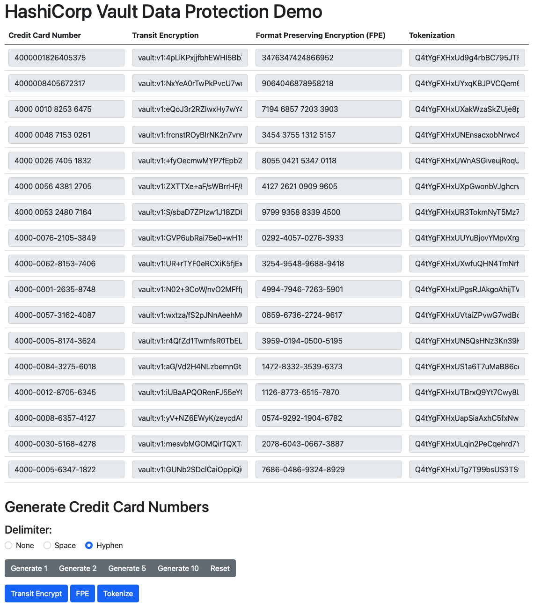

# Vault Data Protection Demo

[HashiCorp](https://hashicorp.com) [Vault](https://vaultproject.io) enables you to not only centralize secrets, but also to protect sensitive data via simple API calls

The [Transform](https://www.vaultproject.io/docs/secrets/transform) Secret Engine in Vault allows you to do [Format Preserving Encryption](https://www.vaultproject.io/docs/secrets/transform#format-preserving-encryption) (FPE) using [FF3-1](https://csrc.nist.gov/publications/detail/sp/800-38g/rev-1/draft). Transform also allows you to [Tokenize](https://www.vaultproject.io/docs/secrets/transform#tokenization) sensitive data, replacing it with an unrelated value called a token. Additionally, Transform allows you to [mask](https://www.vaultproject.io/docs/secrets/transform#masking) sensitive data with a desired character, which is useful for reporting purposes.

The [Transit](https://www.vaultproject.io/docs/secrets/transit) in Vault allows you to encrypt sensitive data.

All of this can be done easily with API calls or the use of a Vault library.

In this repo, we show you how you can setup and demonstrate Transform FPE, Tokenization and Transit [Convergent Encryption](https://www.vaultproject.io/docs/secrets/transit#convergent-encryption).

## Prerequisites

### Vault Enterprise

Use of the Transform Secret Engine requires Vault Enterprise with the Advanced Data Protection (ADP) module. If you do not have Vault Enterprise with ADP, you may reach out to HashiCorp for an [evaluation license](https://www.hashicorp.com/products/vault/trial).

### Docker and docker-compose

In this repo, we setup Vault running in a [Docker](https://www.docker.com) container to make it easy to evaluate ADP. If you already have Vault running, you can skip the steps related to Docker.

### Python3

This repo includes some sample [Python](https://www.python.org) code that uses the [HVAC](https://github.com/hvac/hvac) package to interact with Vault.

Optionally, you can also use the [Flask](https://flask.palletsprojects.com/en/2.0.x/) package to run a web server as a front end to interact with the Transform and Transit secret engines we will configure in Vault.

[pip](https://pypi.org/project/pip/) is used to install these packages.

There are two applications in this repo.

`vault_data_protection_demo_test.py` generates a credit card number, transforms it using FPE, tokenizes it, and returns ciphertext using Transit encryption.

`vault_data_protection_demo.py` uses Flask to run a web UI that you can use to interact with the Transform and Transit secret engines we will configure in Vault.

### TLS Certificates

We use TLS certificates for configuring both Vault and the Python Flask application.

You can either provide the TLS private key and certificate (and certificate chain) and place them, respectively, in `certs/privkey.pem` and `certs/fullchain.pem`, or use `openssl` to generate them as follows:

```
mkdir -p certs vault/certs && \
  openssl req  -nodes -new -x509  -keyout certs/privkey.pem -out certs/fullchain.pem -subj "/C=US/ST=California/L=San Francisco/O=DevOps Cafe/OU=DevOps/CN=127.0.0.1/emailAddress=devops@127.0.0.1" && \
  cp certs/privkey.pem certs/fullchain.pem vault/certs/
```

#### Sample Ouput

```
$ mkdir -p certs vault/certs && \
>   openssl req  -nodes -new -x509  -keyout certs/privkey.pem -out certs/fullchain.pem -subj "/C=US/ST=California/L=San Francisco/O=DevOps Cafe/OU=DevOps/CN=127.0.0.1/emailAddress=devops@127.0.0.1" && \
>   cp certs/privkey.pem certs/fullchain.pem vault/certs/
Generating a 2048 bit RSA private key
........................................+++
....................................................................+++
writing new private key to 'certs/privkey.pem'
-----
```

Please modify the values above as needed for your environment.

## Run Vault in a Docker container

You may skip this and the following steps if you already have a Vault cluster running.

### Build the container

In this demo, we will build upon the [Vault Enterprise Docker Image](https://registry.hub.docker.com/r/hashicorp/vault-enterprise) and add `curl`, `jq` and `bash` to help us run our setup scripts.

```
export DOCKER_IMAGE=vault-enterirse:1.8.5_ent_demo
export DOCKERFILE=Dockerfile.vault-ent-demo
docker rmi ${DOCKER_IMAGE}
docker build -t ${DOCKER_IMAGE} -f ${DOCKERFILE} .
```

#### Sample Output

```
$ export DOCKER_IMAGE=vault-enterirse:1.8.5_ent_demo

$ export DOCKERFILE=Dockerfile.vault-ent-demo

$ docker rmi ${DOCKER_IMAGE}
Untagged: vault-enterirse:1.8.5_ent_demo
Deleted: sha256:587b055db41470690c1eb3fe5772063bccbcf988cc199ecad22238cca7830a74

$ docker build -t ${DOCKER_IMAGE} -f ${DOCKERFILE} .
[+] Building 0.2s (6/6) FINISHED                                                                                         
 => [internal] load build definition from Dockerfile.vault-ent-demo                                                 0.1s
 => => transferring dockerfile: 51B                                                                                 0.0s
 => [internal] load .dockerignore                                                                                   0.0s
 => => transferring context: 2B                                                                                     0.0s
 => [internal] load metadata for docker.io/hashicorp/vault-enterprise:1.8.5_ent                                     0.0s
 => [1/2] FROM docker.io/hashicorp/vault-enterprise:1.8.5_ent                                                       0.0s
 => CACHED [2/2] RUN set -eux;   apk add --no-cache curl jq bash                                                    0.0s
 => exporting to image                                                                                              0.0s
 => => exporting layers                                                                                             0.0s
 => => writing image sha256:587b055db41470690c1eb3fe5772063bccbcf988cc199ecad22238cca7830a74                        0.0s
 => => naming to docker.io/library/vault-enterirse:1.8.5_ent_demo                                                   0.0s

Use 'docker scan' to run Snyk tests against images to find vulnerabilities and learn how to fix them
```

### Environment Variables

The [docker-compose.yaml](docker-compose.yaml) file expects the following environment variables:

* `VAULT_HOSTNAME`
* `VAULT_ADDR`
* `VAULT_SKIP_VERIFY`
* `VAULT_LICENSE`

```
export VAULT_HOSTNAME=localhost
export VAULT_ADDR=https://127.0.0.1:8200
export VAULT_SKIP_VERIFY=true
export VAULT_LICENSE=<vault license>
```

### Start the container:
```
docker-compose up -d
```

#### Sample Output

```
$ docker-compose up -d
Creating network "vault-demo_default" with the default driver
Creating vault-demo_vault_1 ... done
```

### Watch the logs

```
docker-compose logs -f
```

### Initialize and Unseal Vault

```
docker exec -it vault-data-protection-demo_vault_1 /vault/vault_init_unseal.sh
```

#### Sample Output

```
$ docker exec -it vault-data-protection-demo_vault_1 /vault/vault_init_unseal.sh
Waiting for https://127.0.0.1:8200/v1/sys/health to return 501 (not initialized).
Initializing Vault
Writing vaultrc /vault/vaultrc
Waiting for https://127.0.0.1:8200/v1/sys/health to return 503 (sealed).
Unsealing Vault
{
  "type": "shamir",
  "initialized": true,
  "sealed": false,
  "t": 1,
  "n": 1,
  "progress": 0,
  "nonce": "",
  "version": "1.8.5+ent",
  "migration": false,
  "cluster_name": "mac-vault",
  "cluster_id": "e3e89809-e3df-26eb-1c33-a5ad73a340c9",
  "recovery_seal": false,
  "storage_type": "file"
}
Waiting for https://127.0.0.1:8200/v1/sys/health to return 200 (initialized, unsealed, active).
Vault is now initialized, unsealed and active.
{
  "initialized": true,
  "sealed": false,
  "standby": false,
  "performance_standby": false,
  "replication_performance_mode": "disabled",
  "replication_dr_mode": "disabled",
  "server_time_utc": 1636817773,
  "version": "1.8.5+ent",
  "cluster_name": "mac-vault",
  "cluster_id": "e3e89809-e3df-26eb-1c33-a5ad73a340c9",
  "license": {
    "state": "autoloaded",
    "expiry_time": "2022-09-27T23:59:59Z",
    "terminated": false
  }
}
All done.
```

### Enable Audit Logging

Vault [Audit Devices](https://www.vaultproject.io/docs/audit) provide detailed documentation of all requests to and responses from Vault. Sensitive information is normally hashed with a salt using HMAC-SHA256. For demonstration purposes, we will setup audit logging to a file using the default format, to `vault/logs/vault_audit.log`, and we will also enable raw logs to `vault/logs/vault_audit_raw.log` to facilitate review of logs. Please do NOT ever do this in a production or other environment that handles real data.

```
docker exec -it vault-data-protection-demo_vault_1 /vault/vault_enable_audit_log.sh
```

#### Sample Output

```
$ docker exec -it vault-data-protection-demo_vault_1 /vault/vault_enable_audit_log.sh
Enable audit device /vault/logs/vault_audit.log.
Success! Enabled the file audit device at: file/
Enable raw audit device /vault/logs/vault_audit_raw.log.
Success! Enabled the file audit device at: raw/

Path     Type    Description    Replication    Options
----     ----    -----------    -----------    -------
file/    file    n/a            replicated     file_path=/vault/logs/vault_audit.log
raw/     file    n/a            replicated     file_path=/vault/logs/vault_audit_raw.log log_raw=true
All done.
```

## Data Protection Demo

### Setup the Transform and Transit Secret Engines

Now that Vault is initialized and unsealed, and audit logging is enabled, let's setup the Transform and Transit secret engines.

We are going to do this against the Vault cluster running in the Docker container, but if you are running Vault elsewhere, you can modify `vault/vault_data_protection_demo_setup.sh` to run directly.

```
docker exec -it vault-data-protection-demo_vault_1 /vault/vault_data_protection_demo_setup.sh
```

#### Sample Output

```
$ docker exec -it vault-data-protection-demo_vault_1 /vault/vault_data_protection_demo_setup.sh
Configuring Transit Convergent Encryption
Success! Disabled the secrets engine (if it existed) at: transit-demo/
Success! Enabled the transit secrets engine at: transit-demo/
Success! Data written to: transit-demo/keys/vault-demo-key
Configuring Transform FPE
Success! Disabled the secrets engine (if it existed) at: transform-demo/
Success! Enabled the transform secrets engine at: transform-demo/
Success! Data written to: transform-demo/role/vault-fpe-role
Keys
----
vault-fpe-role
Success! Data written to: transform-demo/transformations/fpe/card-number
Success! Uploaded policy: vault-demo-transform-encode
Success! Uploaded policy: vault-demo-transform-decode
Configuring Transform Tokenization
Success! Disabled the secrets engine (if it existed) at: tokenization-demo/
Success! Enabled the transform secrets engine at: tokenization-demo/
Success! Data written to: tokenization-demo/role/vault-tokenize-role
Success! Data written to: tokenization-demo/transformations/tokenization/credit-card
All done.
```

### Install the Python Libraries

Let's install the `hvac` and `Flask` packages if they are not already installed. You may need to use sudo to install these packages.


```
python3 -m pip install hvac
python3 -m pip install Flask
```

#### Sample Output

```
$ sudo  python3 -m pip install hvac
Collecting hvac
  Downloading https://files.pythonhosted.org/packages/3f/a9/c9362c1728aba6579f1c9d8853302b3a04727ffe77240364ecd4bcafee81/hvac-0.11.2-py2.py3-none-any.whl (148kB)
Requirement already satisfied: six>=1.5.0 in /Library/Developer/CommandLineTools/Library/Frameworks/Python3.framework/Versions/3.8/lib/python3.8/site-packages (from hvac) (1.15.0)
Collecting requests>=2.21.0 (from hvac)
  Downloading https://files.pythonhosted.org/packages/92/96/144f70b972a9c0eabbd4391ef93ccd49d0f2747f4f6a2a2738e99e5adc65/requests-2.26.0-py2.py3-none-any.whl (62kB)
Collecting charset-normalizer~=2.0.0; python_version >= "3" (from requests>=2.21.0->hvac)
  Downloading https://files.pythonhosted.org/packages/de/c8/820b1546c68efcbbe3c1b10dd925fbd84a0dda7438bc18db0ef1fa567733/charset_normalizer-2.0.7-py3-none-any.whl
Collecting idna<4,>=2.5; python_version >= "3" (from requests>=2.21.0->hvac)
  Downloading https://files.pythonhosted.org/packages/04/a2/d918dcd22354d8958fe113e1a3630137e0fc8b44859ade3063982eacd2a4/idna-3.3-py3-none-any.whl (61kB)
Collecting certifi>=2017.4.17 (from requests>=2.21.0->hvac)
  Downloading https://files.pythonhosted.org/packages/37/45/946c02767aabb873146011e665728b680884cd8fe70dde973c640e45b775/certifi-2021.10.8-py2.py3-none-any.whl (149kB)
Collecting urllib3<1.27,>=1.21.1 (from requests>=2.21.0->hvac)
  Downloading https://files.pythonhosted.org/packages/af/f4/524415c0744552cce7d8bf3669af78e8a069514405ea4fcbd0cc44733744/urllib3-1.26.7-py2.py3-none-any.whl (138kB)
Installing collected packages: charset-normalizer, idna, certifi, urllib3, requests, hvac
Successfully installed certifi-2021.10.8 charset-normalizer-2.0.7 hvac-0.11.2 idna-3.3 requests-2.26.0 urllib3-1.26.7

$ sudo python3 -m pip install Flask
Collecting Flask
  Downloading https://files.pythonhosted.org/packages/8f/b6/b4fdcb6d01ee20f9cfe81dcf9d3cd6c2f874b996f186f1c0b898c4a59c04/Flask-2.0.2-py3-none-any.whl (95kB)
Collecting Jinja2>=3.0 (from Flask)
  Downloading https://files.pythonhosted.org/packages/20/9a/e5d9ec41927401e41aea8af6d16e78b5e612bca4699d417f646a9610a076/Jinja2-3.0.3-py3-none-any.whl (133kB)
Collecting click>=7.1.2 (from Flask)
  Downloading https://files.pythonhosted.org/packages/48/58/c8aa6a8e62cc75f39fee1092c45d6b6ba684122697d7ce7d53f64f98a129/click-8.0.3-py3-none-any.whl (97kB)
Collecting itsdangerous>=2.0 (from Flask)
  Downloading https://files.pythonhosted.org/packages/9c/96/26f935afba9cd6140216da5add223a0c465b99d0f112b68a4ca426441019/itsdangerous-2.0.1-py3-none-any.whl
Collecting Werkzeug>=2.0 (from Flask)
  Downloading https://files.pythonhosted.org/packages/1e/73/51137805d1b8d97367a8a77cae4a792af14bb7ce58fbd071af294c740cf0/Werkzeug-2.0.2-py3-none-any.whl (288kB)
Collecting MarkupSafe>=2.0 (from Jinja2>=3.0->Flask)
  Downloading https://files.pythonhosted.org/packages/bf/10/ff66fea6d1788c458663a84d88787bae15d45daa16f6b3ef33322a51fc7e/MarkupSafe-2.0.1.tar.gz
Building wheels for collected packages: MarkupSafe
  Building wheel for MarkupSafe (setup.py) ... done
  Created wheel for MarkupSafe: filename=MarkupSafe-2.0.1-cp38-cp38-macosx_10_14_6_x86_64.whl size=18191 sha256=ca9b99ec09bd57ea63f682c92945cfe4dc0fe7235c1cdfe5ba0ce53d8d2a4fe5
  Stored in directory: /Users/khemani/Library/Caches/pip/wheels/21/8d/8d/03713c46963ee240d5105dd963d75b655461e13c95332962c4
Successfully built MarkupSafe
Installing collected packages: MarkupSafe, Jinja2, click, itsdangerous, Werkzeug, Flask
Successfully installed Flask-2.0.2 Jinja2-3.0.3 MarkupSafe-2.0.1 Werkzeug-2.0.2 click-8.0.3 itsdangerous-2.0.1
```

### Run the Python Data Protection Demo

If you are running Vault in Docker, we can source the `vault/vaultrc` file to setup our environment.

```
. vault/vaultrc
```

Let's run `vault_data_protection_demo_test.py` to generate a credit card number, transform it using FPE, tokenize it, and returns ciphertext of the credit card number using Transit encryption.

```
python3 vault_data_protection_demo_test.py
```

#### Sample output:

```
$ . vault/vaultrc

$ python3 vault_data_protection_demo_test.py
context is Q1pIRGFtNHRrYWhFR2VrSEtOWjBITlRsYTdoZW9KRG1SeQ==
Test results:
  test card:                   4000 0052 6703 8413

  test transform fpe encode:   5643 1147 8018 7280
  test transform fpe decode:   4000 0052 6703 8413

  test transform token encode: Q4tYgFXHxULheDazU3B6edDC55UC1cYtz5xJh3BWp7wApctgkdDevj
  test transform token decode: 4000 0052 6703 8413

  test transit encrypt:        vault:v1:Sy6R0M04tnZ8p3HYGaJYJu76QQjBIQEXd4WxySvsstwIsiEVPqDYw5xQYmkKOa4=
  test transit decrypt:        4000 0052 6703 8413
```

Let's run `vault_data_protection_demo.py` to start our Flask app.

```
python3 vault_data_protection_demo.py
```

We can now interact with it in a web browser.

You can optionally specify a delimiter (a space or a hyphen) in the sample data set, and then generate the number of samples you would like for your test.

You can then use the Transit Encryption, FPE and Tokenize buttons to perform the respective functions.




### Cleanup

To clean up after you finish with the Vault Data Protection demo, you can optionally clean up what was done.

Please note that this will remove all Vault data, audit logs, and related information.

```
./cleanup.sh
```

#### Sample Output

```
$ ./cleanup.sh 
Stopping vault-data-protection-demo_vault_1 ... done
Removing vault-data-protection-demo_vault_1 ... done
Removing network vault-demo_default
vault/raft/raft/snapshots
vault/raft/raft/raft.db
vault/raft/raft
vault/raft/vault.db
vault/logs/vault_audit.log
vault/logs/vault_audit_raw.log
```

---
